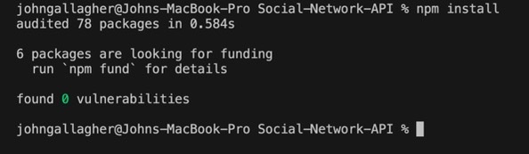
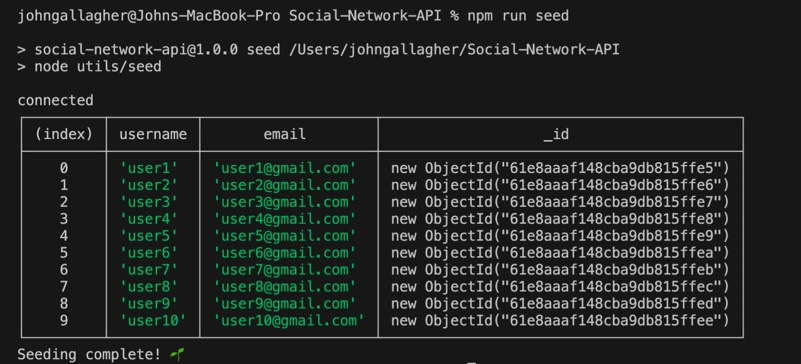

# Social-Network-API

## Description

In this project, I created the back-end for a social network api using mongoDB, mongoose, and Express.js. This framework would make it possible to create users, friends, thoughts, and reactions to thoughts. The routes were tested using Insomnia.

## License:  

## Table of Contents
1. [Description](#description)
2. [Installation](#installation)
3. [Usage](#usage)
4. [Credits](#credits)
5. [Contributing](#contributing)
6. [License](#license)
7. [Questions](#questions)

## Installation

In order for this application to work you will need the node environment and MongoDB installed on your computer. Adequate instructions for downloading the node environment can be found at nodejs.org. Instructions for downloading MongoDB can be found at mongodb.com. To install all dependencies for this program, start by opening the index.js file in an integrated terminal and run "npm install".

## Usage
1. Make sure all dependencies are installed by running npm install.
  
2. To seed and create the database, run "npm run seed".
  
3. To start the server open the index.js file in an integrated terminal and run node index.js, or run "npm run start".
4. From here you can test all of the routes using Insomnia or a similar API.
  
  

A walkthrough video can be seen via this link: https://watch.screencastify.com/v/GkSgTNU0OoFbKmEivh0X

## Credits

- MDN Web Docs
- Tutor: Aaron Centeno
- npmjs.com
- mongodb.com
- mongoose.com
- VSCode
- StackOverflow

## Contributing

  
For contributing guidelines see link : https://www.contributor-covenant.org/

## License 
This Project is licensed under the MIT license.

* https://opensource.org/licenses/MIT

## Questions

Follow link for github: [Github Profile] (https://github.com/gallaghj13)  
For any additional questions you can reach me at: gallagherj0913@gmail.com